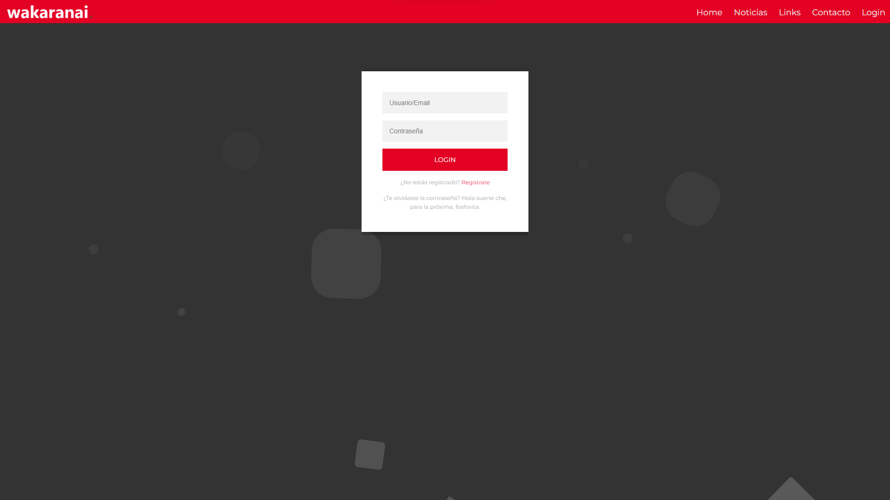

# Wakaranai - TP Integrador Bootcamp NUCBA

## Descripción

Wakaranai es una landing page dedicada a la cultura japonesa y las noticias relacionadas. Una plataforma para que los amantes de la cultura japonesa puedan mantenerse al día con las últimas noticias y encontrar enlaces a recursos útiles. 

## Capturas de Pantalla

_Descripción: Página de inicio de Wakaranai._

_Descripción: Sección de Sign In._

_Descripción: Sección de Log In._

## Características Principales

- **Información Actualizada**: Mantente informado sobre las últimas noticias relacionadas con Japón y la cultura japonesa.

- **Recursos Útiles**: Encuentra enlaces a recursos externos, como perfiles de Instagram, canales de YouTube y tiendas de productos otakus.

- **Diseño Atractivo**: El diseño de la landing page es visualmente atractivo y fácil de navegar.

## Tecnologías Utilizadas

- HTML
- CSS

## Contacto

Si tienes alguna pregunta o comentario sobre esta landing page, no dudes en ponerte en contacto con nosotros:

- Email: halejandrorosa@gmail.com
